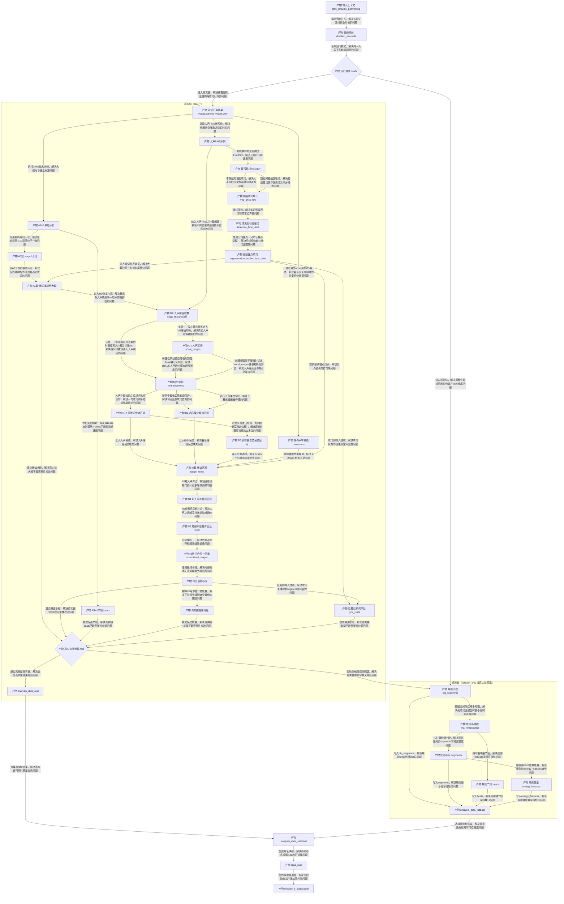

# 模块A Mermaid总览图

## 1. 说明
- 本文仅提供模块A链路 Mermaid 可视化图。
- 术语与命名遵循 `模块A_JSON产物输出链路总览.md` 中的统一命名口径（`A0/AL/B/M/S`、`BT*/ST*`）。

## 2. 总览图

## 3. 图例（缩写速查）
- `A0段`：Allin1 直出大段（stage1）。
- `AL段`：按歌词证据重算后的大段。
- `M段`：中段（按人声能量先切出的内部段，不直接对外）。
- `R段`：候选区间（歌词优先与器乐保护后的候选切分结果）。
- `N段`：并合归一区间（短段并合与时间轴归一后的内部结果）。
- `S段`：最终对外小段（`segments`）。
- `长前置占位段`：人声路径里两句歌词之间 gap 过长时，从前一句结束到后一句开始单独拆出的占位区间（`preserve_gap_segment=true`），用于避免超长空档被吞并到歌词段内。
- `BT* / ST*`：属于 `alias_map` 的时间戳命名视图，本图为突出主产物链路已省略显示。
- `analysis_data`：模块A中间汇总结构（大段/小段/beats/歌词/能量）。

## 4. M段SOP（判断标准）
1. `AL段 -> M0`：先按大段标签做“门控分支”。  
器乐标签命中（`intro/inst/outro/...`）直接落到 `M段(inst)`，不进入人声阈值切分；只有非器乐标签才进入 `M1` 人声RMS判定。
2. `M0` 阈值计算：  
静音地板 `floor` 由人声RMS低分位估计并夹紧到 `[0.0015, 0.02]`；  
人声阈值 `vocal_threshold = min(0.08, floor + max(0.0008, floor*0.25))`。
3. `M0 -> M1`：在每个非器乐大段内，用单阈值提取 `vocal_ranges`。  
若整段峰值不高于 `vocal_threshold`，该段回落为器乐中段。  
4. `M1 -> M段`：对已切出的人声区间做平滑与最小时长过滤。  
`min_vocal = max(0.06, mid_segment_min_duration*0.15)`；  
`min_silence = max(0.08, mid_segment_min_duration*0.35)`；  
并合相邻同角色毛刺段后，将结果写回 `M段`（既可能有人声子段，也可能有器乐子段）。
5. `M段 -> R1`（人声路径）：  
按歌词锚点切句；句间 gap 处理为：`<=5.0s` 前并到前一句末尾，`>5.0s` 拆出独立占位段（保留标记 `preserve_gap_segment`）。  
职责边界说明：`R7 -> R8` 负责“生成锚点证据”，`M段 -> R1` 负责“消费锚点并真正切句”，两步不是重复关系。
6. `M段 -> R2`（器乐路径）：  
先做边界歌词保护（窗口 `0.35s`、最小微段 `0.06s`）；  
对器乐长段仅单次切分：时长 `<4.0s` 不切，`>=4.0s` 才切，候选优先 `onset`，无 onset 才用 `beat`，切点选能量突变最大。
7. `R段 -> N1 -> N2`：  
先并合短人声无歌词段（阈值默认 `1.2s`）；  
再并合人声之间短器乐空挡（跨组 `1.2s`，同组 `1.4s`）；  
最后统一时间轴连续性，输出 `N段`。
8. `N段 -> S段`：  
生成最终 `segments`（`segment_id/start/end/label/big_segment_id`），首段对齐 `0`、末段对齐总时长。
